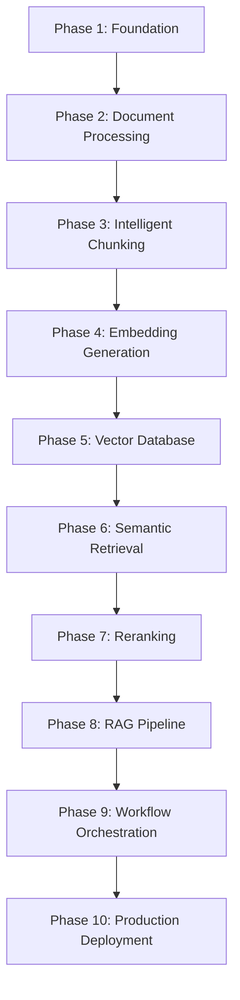

# ⚡ VectorLoom

> Enterprise Retrieval-Augmented Generation (RAG) Platform for Intelligent Document Understanding

VectorLoom is a modular, production-ready RAG system designed to ingest documents, process them into semantic knowledge, and deliver accurate AI-powered answers through modern retrieval pipelines.

---

# 🚀 Features

- 📄 Multi-format Document Ingestion
- 🔍 OCR Support
- ✂ Intelligent Chunking Strategies
- 🧠 Embedding Generation
- 📦 Vector Database Integration
- 🔎 Semantic Search
- 🎯 Reranking Pipeline
- 🤖 Retrieval-Augmented Generation (RAG)
- ⚡ FastAPI Backend
- 🌐 Streamlit Dashboard
- 🔄 Apache Airflow Orchestration
- 🐳 Docker Deployment

---

# 🏗️ Tech Stack

## Backend

- Python
- FastAPI
- Pydantic

## AI / NLP

- Sentence Transformers
- HuggingFace Transformers
- LangChain

## Vector Databases

- FAISS
- ChromaDB
- Qdrant (Optional)

## Orchestration

- Apache Airflow

## Frontend

- Streamlit

## Deployment

- Docker
- Docker Compose

---

# 📁 Project Structure

```text
VectorLoom/

├── airflow/
├── config/
├── data/
│   ├── raw/
│   ├── processed/
│   └── cache/
│
├── frontend/
├── logs/
├── models/
├── src/
├── tests/
│
├── README.md
├── requirements.txt
├── Dockerfile
└── .env
```

---

# 🗺️ Development Roadmap

The system is built incrementally so that every phase produces a working component before introducing additional complexity.



---

# 📍 Phase Checklist

## ✅ Phase 1 — Foundation

- Project Structure
- Virtual Environment
- Configuration Management
- Logging
- FastAPI Skeleton
- Streamlit Skeleton
- Docker Setup

---

## 📄 Phase 2 — Document Processing

- PDF Loader
- DOCX Loader
- TXT Loader
- OCR Pipeline
- Metadata Extraction

---

## ✂ Phase 3 — Intelligent Chunking

- Recursive Chunking
- Semantic Chunking
- Overlap Strategies
- Metadata Preservation

---

## 🧠 Phase 4 — Embedding Generation

- Sentence Transformers
- Batch Embeddings
- Embedding Cache
- Embedding Versioning

---

## 📦 Phase 5 — Vector Database

- FAISS
- ChromaDB
- CRUD Operations
- Persistence

---

## 🔎 Phase 6 — Semantic Retrieval

- Similarity Search
- Metadata Filtering
- Top-K Retrieval
- Hybrid Search

---

## 🎯 Phase 7 — Reranking

- Cross Encoder
- Context Scoring
- Result Optimization

---

## 🤖 Phase 8 — RAG Core

- Prompt Templates
- Context Injection
- LLM Integration
- Response Generation

---

## 🔄 Phase 9 — Workflow Orchestration

- Apache Airflow DAGs
- Automated Ingestion
- Scheduled Embeddings
- Monitoring

---

## 🚀 Phase 10 — Production

- Docker
- Docker Compose
- CI/CD
- API Documentation
- Monitoring
- Cloud Deployment

---

# 🎯 Final Goal

A fully modular, enterprise-grade Retrieval-Augmented Generation system capable of:

- Ingesting thousands of documents
- Building semantic knowledge bases
- Performing intelligent retrieval
- Generating context-aware AI responses
- Running automated ingestion pipelines
- Deploying to production environments